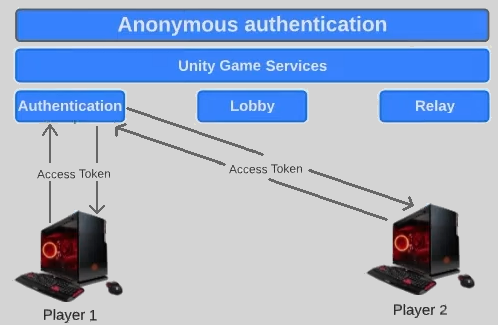
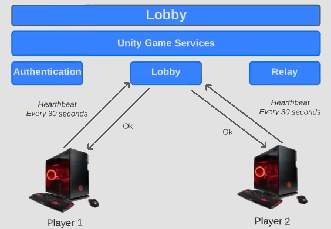
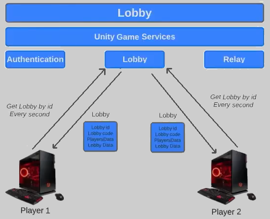
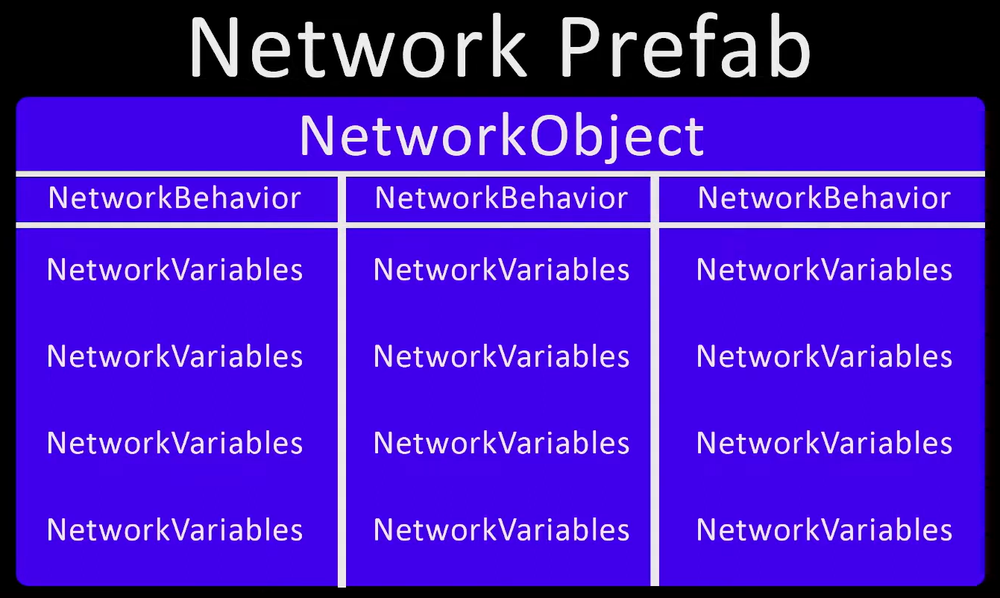

# Unity-Multiplayer-with-Netcode-for-GameObjects
This is a sample project of using Netcode for GameObject to create a multiplayer game

## 1: Create and Join Lobby
- Step 1: Download packages
  - Authentication 3.3.3, Lobby 1.2.2

- Step 2: Connect to **Unity Service**
  - Log in Unity account 
  - Create new project on Unity Cloud with name: **Unity-Multiplayer-with-Netcode-for-GameObjects**
  - Project Settings -> Services -> Link to the **Unity-Multiplayer-with-Netcode-for-GameObjects** project

### Explain the flow
Each player may request an **Access Token** from the Authentication Service, this **Access Token** is used for many Unity Services: Relay, Lobby,..  

- One player (the Host) will call the Lobby Service to make a **create lobby request**. Lobby service will check if the current player is authenticated or not, if player is authenticated => Lobby service will create a new lobby and send back a **Lobby object** to the player (the Host) (it may contains: lobby id, lobby code, players data, lobby data)

- Trong quá trình chơi, người chơi sẽ không trực tiếp tương tác với nhau, mà phải truyền data thông qua Lobby Service. Ta sẽ cần yêu cầu Lobby Service làm mới Lobby sau mỗi một khoảng thời gian nhất định

- Lobby Service sẽ có life-cycle khác so với game, Lobby service sẽ đóng sau 1 khoảng thời gian không nhận được thông tin gì từ người chơi. Ta sẽ cần gửi đi các HeartBeatRequest để đảm bảo Lobby không bị dừng lại 

- HeartbeatLobby keeps the server aware of active clients
- RefreshLobby keeps clients aware of the current state of the lobby. 
- Both are vital for a smooth and reliable multiplayer experience

**HeartbeatLobby**: a periodic message sent by each client to the server to indicate that they are still connected and active. It's essential for:
- Detecting disconnections: If the server doesn't receive a heartbeat within a certain timeframe, it knows the client has likely disconnected (due to network issues, crashes, etc.). This allows the server to remove the player from the game and update the lobby accordingly.

- Maintaining session state: Heartbeats can also carry minimal information about the client's state (e.g., current health, ready status), allowing the server to keep track of player status without constant updates.

**RefreshLobby**: This request is typically initiated by a client to get the latest state of the lobby. It's needed because:
- Lobby updates: Other players might join or leave the lobby. The RefreshLobby request ensures that each client has the most up-to-date list of players and their statuses.
- Handling asynchronous actions: If a player changes their ready status or performs some other action that affects the lobby, the server needs a mechanism to inform other clients. RefreshLobby provides a way for clients to request this information.
- Error handling: If a client experiences a temporary network hiccup, it might miss some updates. RefreshLobby allows it to resynchronize with the server's state.

Ta sẽ cần triển khai một Coroutine để gửi đi các **HeartBeatRequest** theo thời gian   

Ta cũng sẽ cần triển khai Coroutine để gửi đi yêu cầu cập nhật sau mỗi khoảng thời gian nhất định   

## 2: Sync Lobby Data

## 3: Connect players using Relay Service
- Step 1: Download Relay package

## 4: Unity Netcode for Gameobjects
- Step 1: Download packages: **Netcode for GameObjects** 1.8.1, **Multiplayer Tools** 1.1.1
- Step 2: Download some more packages: **Cinemachine** 2.9.7, **Input System** 1.7.0

- NetworkTransform component is server authoritative: only changes made on the server will be replicated to the clients
## 5: Player movement with ServerRPC
- Remote Procedure Call (RPC) is a powerful technique for constructing distributed, client-server based applications. It is based on extending the conventional local procedure calling so that the called procedure need not exist in the same address space as the calling procedure. The two processes may be on the same system, or they may be on different systems with a network connecting them.

### 5.1 Client Prediction
- Client-side prediction is a network programming technique used in video games intended to conceal negative effects of high latency connections. The technique attempts to make the player's input feel more instantaneous while governing the player's actions on a remote server.

### 5.2 Network Variables

### 5.3 Using Networked Raycast

# References

<a href = "https://www.youtube.com/playlist?list=PLxmtWA2eKdQSf2EXE-tv0lmqmmdDzs0fV">Unity Multiplayer tutorial</a> - Carl Boisvert Dev