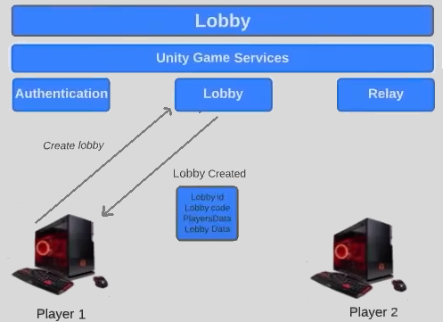
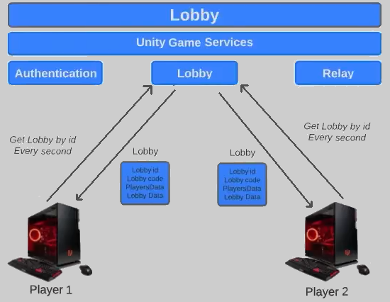

# Set up
## Yêu cầu
- **Unity Editor**: 2022.3.24f1
- Packages: 
  - **Authentication** 3.3.3, **Lobby** 1.2.2, **Netcode for GameObjects** 1.8.1, **Multiplayer Tools** 1.1.1
  - **Cinemachine** 2.9.7, **Input System** 1.7.0

## 1: Create and Join Lobby
- B1: Kết nối với **Unity Service**
  - Đăng nhập Unity account 
  - Tạo 1 project mới trên Unity Cloud
  - Kết nối local Unity project với Unity Cloud project vừa tạo: Project Settings -> Services -> Link to the <project_name> project

# 
## Explain the flow
Each player may request an **Access Token** from the Authentication Service, this **Access Token** is used for many Unity Services: Relay, Lobby,..  

- One player (the Host) will call the Lobby Service to make a **create lobby request**. Lobby service will check if the current player is authenticated or not, if player is authenticated => Lobby service will create a new lobby and send back a **Lobby object** to the player (the Host) (it may contains: lobby id, lobby code, players data, lobby data)

- Trong quá trình chơi, người chơi sẽ không trực tiếp tương tác với nhau, mà phải truyền data thông qua Lobby Service. Ta sẽ cần yêu cầu Lobby Service làm mới Lobby sau mỗi một khoảng thời gian nhất định

- Lobby Service sẽ có life-cycle khác so với game, Lobby service sẽ đóng sau 1 khoảng thời gian không nhận được thông tin gì từ người chơi. Ta sẽ cần gửi đi các HeartBeatRequest để đảm bảo Lobby không bị dừng lại 

- HeartbeatLobby keeps the server aware of active clients
- RefreshLobby keeps clients aware of the current state of the lobby. 
- Both are vital for a smooth and reliable multiplayer experience

## Keywords
**HeartbeatLobby**: 
- Mục đích: gửi các thông báo định kì tới server, cho biết client này vẫn đang hoạt động. 
- Lợi ích:
  - **Nhận biết sự cố mất kết nối**: nếu server không nhận được 1 heartbeat nào trong khoảng thời gian nhất định, client này sẽ được coi là đã mất kết nối (có thể do vấn đề về mạng, crash,..). Sau đó, server có thể xóa client này, và cập nhật lại lobby 
  - **Duy trì session state**: Heartbeats có thể mang 1 số thông tin cơ bản về client's state (Hp, trạng thái sẵn sàng), cho phép server nắm được 1 số thông tin mà không cần phải cập nhật liên tục

**RefreshLobby**: 
- Mục đích: yêu cầu server trả về đầy đủ data của lobby hiện tại, gồm: danh sách player, các thuộc tính của lobby,..
- Lợi ích:
  - Cập nhật lại lobby: trong 1 lobby, nhiều sự kiện có thể diễn ra: các player tham gia hoặc rời lobby, player thay đổi trạng thái sẵn sàng. Tất cả player trong lobby đều phải nhận được thông tin về những sự thay đổi này

  

<figure>
  
 
  <figcaption style="text-align: center">Heartbeat request</figcaption>
</figure>

 

<figure>
  
 
  <figcaption style="text-align: center">Refresh request</figcaption>
</figure>

## 2: Sync Lobby Data

## 3: Connect players using Relay Service
- Step 1: Download Relay package

## 4: Unity Netcode for Gameobjects
- Step 1: Download packages: **Netcode for GameObjects** 1.8.1, **Multiplayer Tools** 1.1.1
- Step 2: Download some more packages: **Cinemachine** 2.9.7, **Input System** 1.7.0

- NetworkTransform component is server authoritative: only changes made on the server will be replicated to the clients
## 5: Player movement with ServerRPC
- Remote Procedure Call (RPC) is a powerful technique for constructing distributed, client-server based applications. It is based on extending the conventional local procedure calling so that the called procedure need not exist in the same address space as the calling procedure. The two processes may be on the same system, or they may be on different systems with a network connecting them.

### 5.1 Client Prediction
- Client-side prediction is a network programming technique used in video games intended to conceal negative effects of high latency connections. The technique attempts to make the player's input feel more instantaneous while governing the player's actions on a remote server.

### 5.2 Network Variables

### 5.3 Using Networked Raycast

## 6. Client Reconciliation
- Nếu 1 client ngắt kết nối (kể cả do crash), những client khác vẫn có thể biết được thông tin này (do server cung cấp). Tuy nhiên, nếu server ngắt kết nối, các client khác sẽ khó mà nhận được thông tin này (vẫn sẽ mất kết nối)

# References

<a href = "https://www.youtube.com/playlist?list=PLxmtWA2eKdQSf2EXE-tv0lmqmmdDzs0fV">Unity Multiplayer tutorial</a> - Carl Boisvert Dev  
<a href = "https://docs-multiplayer.unity3d.com/">Unity Multiplayer documents</a> - Unity